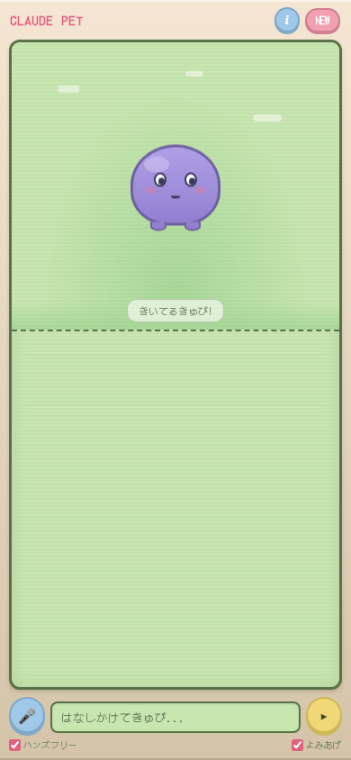

# ClawPet

Termux + Chrome で動く、たまごっち風 AI 音声チャットペット。



## 特徴

- **完全無料** — 追加APIキー不要。Claude CLI + Chrome内蔵APIだけで動作
- **音声対話** — Chrome Web Speech API で音声認識・読み上げ
- **ハンズフリー** — 散歩中でもスマホに話しかけるだけで対話できる
- **たまごっち風UI** — ピクセルフォント、レトロな液晶画面、かわいいペットキャラクター
- **会話記憶** — localStorage に保存。リロードしても会話が残る。文脈を踏まえて返答
- **Web検索対応** — 天気やニュースなどリアルタイム情報も聞ける
- **うんち機能** — 定期的にうんちが出る。タップでお掃除すると喜ぶ
- **独り言** — ペットが定期的につぶやく

## 必要なもの

- Android端末
- [Termux](https://termux.dev/)
- [Claude CLI](https://docs.anthropic.com/en/docs/claude-code) (`claude` コマンドが使える状態)
- Python 3
- Chrome ブラウザ

## セットアップ

```bash
# リポジトリをクローン
git clone https://github.com/kazuph/clawpet.git
cd clawpet

# サーバー起動
nohup python3 server.py >> server.log 2>&1 &

# Chrome で開く
am start -a android.intent.action.VIEW -d "http://127.0.0.1:8888"
```

## 使い方

| 操作 | 説明 |
|------|------|
| マイクボタン | 音声入力の開始/停止 |
| ハンズフリー | ON: ペットが喋り終わったら自動で聞き取り再開 |
| よみあげ | ON: ペットの返答を音声で読み上げ |
| 吹き出しタップ | 喋ってる途中→停止 / 停止中→もう一度再生 |
| NEW | 会話履歴をリセット |
| i ボタン | アプリの説明を表示 |
| うんちタップ | お掃除！ペットが喜ぶ |

## 仕組み

```
Chrome (音声入力) → Python HTTP サーバー → claude -p (Claude CLI) → Chrome (音声出力)
```

- フロントエンド: HTML/CSS/JS (ピクセルフォント DotGothic16)
- バックエンド: Python 標準ライブラリのみ (`http.server`)
- AI: Claude CLI (`--model haiku --effort low`)
- 音声認識: Chrome Web Speech API (`webkitSpeechRecognition`)
- 音声合成: Chrome SpeechSynthesis API
- 依存パッケージ: なし

## 停止

```bash
pkill -f "python3 server.py"
```

## ライセンス

MIT
